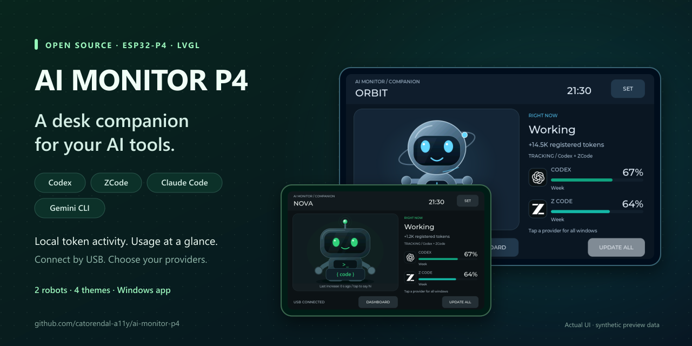
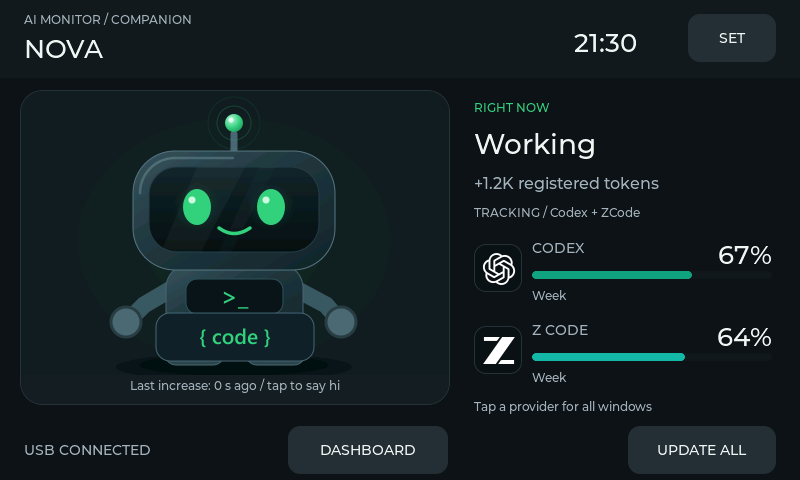
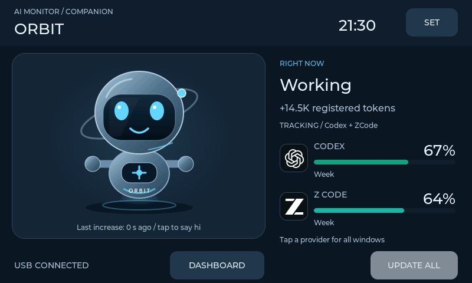
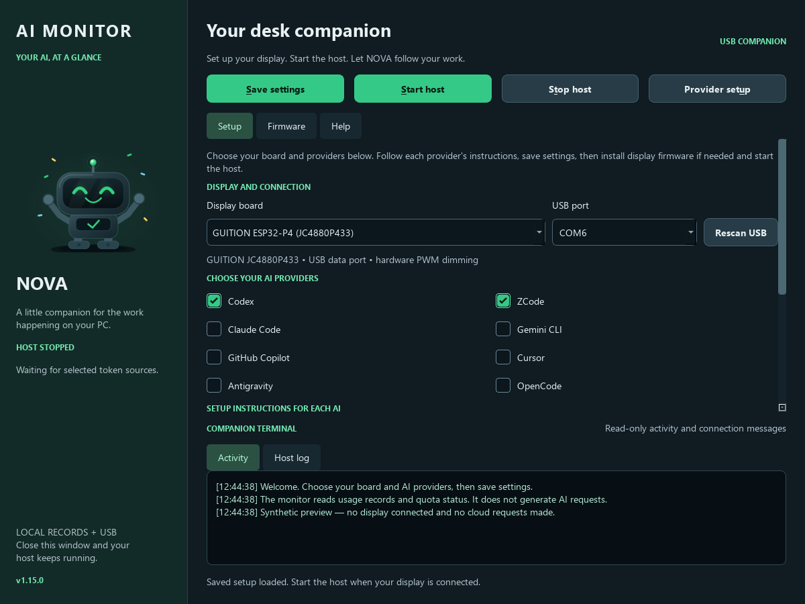
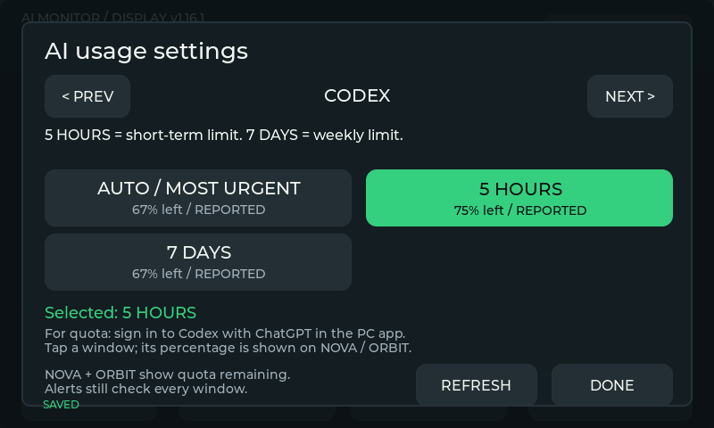
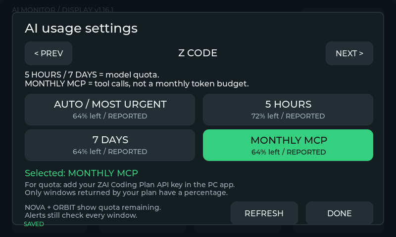
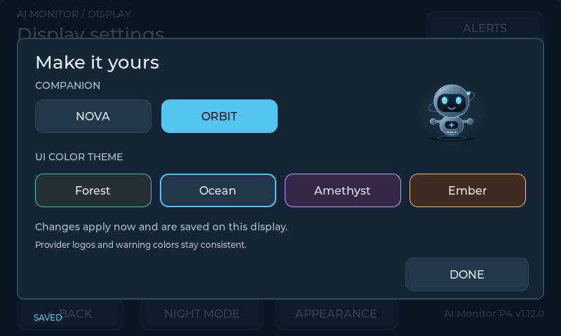
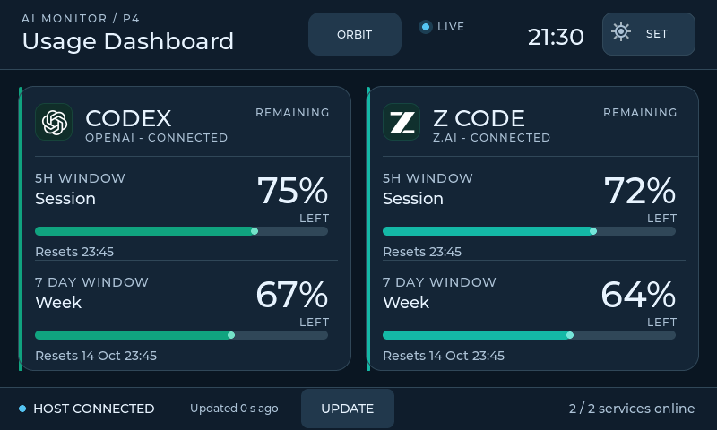
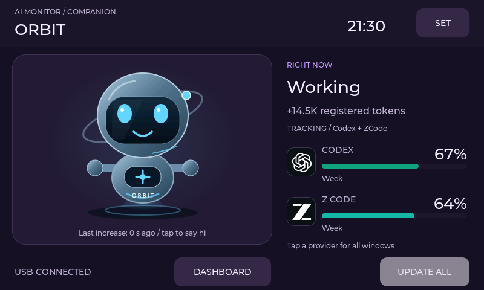
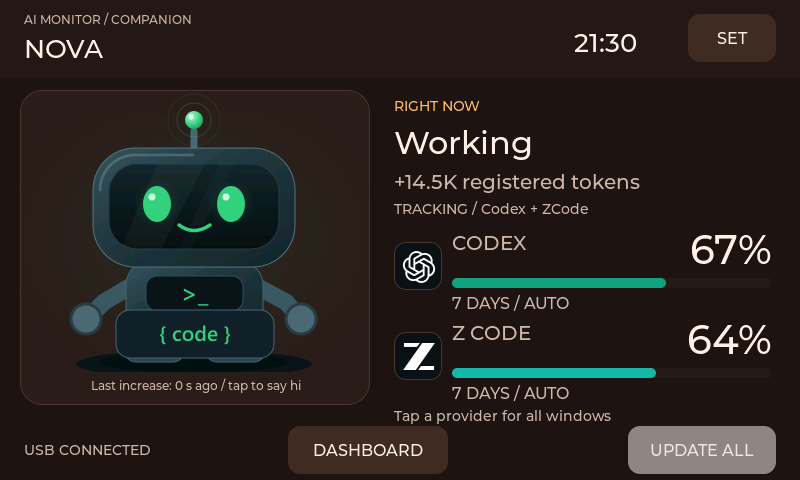

# AI Monitor — ESP32-P4 and ESP32-S3 AI Desk Companion

A USB touchscreen AI usage monitor for **Codex, ZCode, Claude Code and Gemini CLI**. See supported account limits at a glance and let **NOVA** or **ORBIT** react to recorded token activity on your PC.



<p align="center">
  <a href="https://github.com/catorendal-a11y/ai-monitor-p4-s3/releases/latest"></a>
  <a href="https://github.com/catorendal-a11y/ai-monitor-p4-s3/commits/main"></a>
  <a href="https://github.com/catorendal-a11y/ai-monitor-p4-s3/actions/workflows/ci.yml"></a>
  <a href="LICENSE"></a>
  <a href="https://github.com/catorendal-a11y/ai-monitor-p4-s3/stargazers"></a>
</p>
<p align="center">
  <a href="docs/BOARDS.md"></a>
  <a href="docs/BOARDS.md"></a>
  <a href="docs/BOARDS.md"></a>
  <a href="platformio.ini"></a>
  <a href="docs/DEVELOPMENT.md"></a>
</p>
<p align="center">
  <a href="docs/CODEX_SETUP.md"></a>
  <a href="docs/PROVIDERS.md#zcode"></a>
  <a href="docs/PROVIDERS.md#claude-code"></a>
  <a href="docs/PROVIDERS.md#gemini-cli"></a>
  <br>
  <a href="docs/PROVIDERS.md#external-numeric-bridge"></a>
  <a href="docs/PROVIDERS.md#external-numeric-bridge"></a>
  <a href="docs/PROVIDERS.md#external-numeric-bridge"></a>
  <a href="docs/PROVIDERS.md#external-numeric-bridge"></a>
</p>
<p align="center">
  <a href="#make-it-yours"></a>
  <a href="#make-it-yours"></a>
  <a href="docs/QUICK_START.md#everyday-use"></a>
  <a href="docs/QUICK_START.md"></a>
</p>
<p align="center">
  <a href="https://github.com/catorendal-a11y/ai-monitor-p4-s3/releases/latest"></a>
  <a href="docs/QUICK_START.md"></a>
  <a href="docs/QUICK_START.md"></a>
  <a href="docs/DEVELOPMENT.md"></a>
</p>
<p align="center">
  <a href="docs/GITHUB_SECURITY.md"></a>
  <a href="docs/PROVIDERS.md#privacy-and-limits"></a>
  <a href="docs/GITHUB_SECURITY.md"></a>
</p>

*Quota needs the provider's supported account/key/bridge. Gemini and external numeric bridges report activity only. S3 remains experimental. Windows binaries are currently unsigned.*

[](https://github.com/catorendal-a11y/ai-monitor-p4-s3)

**[Download for Windows](https://github.com/catorendal-a11y/ai-monitor-p4-s3/releases/latest)** · [Quick Start](docs/QUICK_START.md) · [Provider setup](docs/PROVIDERS.md) · [Ask a question](https://github.com/catorendal-a11y/ai-monitor-p4-s3/discussions/categories/q-a)

**Why put AI activity on your desk?** Keep supported quota windows visible on a dedicated display, and see registered work without opening another app. The PC companion connects to your selected P4 or S3 display over USB. Choose the providers you use, pick your robot and colors, and keep your main screen for your work.

**Two board choices · Two animated robots · Four color themes · No AI preselected · Portable Windows setup**

## Meet your desk companion

| NOVA | ORBIT with the Ocean theme |
| --- | --- |
|  |  |

These previews are rendered from the actual LVGL interface using synthetic data. They are UI renders, not photographs of the display.

The companion panel uses less horizontal space while preserving the robot's size. Usage percentages, provider names and status text have larger fonts so they are easier to read on the 4.3-inch display.

## What you need

Choose one of the two firmware targets:

| Display board | Status | USB connector |
| --- | --- | --- |
| **GUITION JC4880P433 ESP32-P4** | Supported | Espressif USB data port |
| **Original Waveshare ESP32-S3-Touch-LCD-4.3** | **Experimental; not yet tested on physical S3 hardware** | **USB TO UART**, for flashing and daily use |

The S3 target is the original CH422G model, **not B or C**. [Board compatibility, brightness differences and setup](docs/BOARDS.md).

- Your selected board from the table above.
- A **USB data cable** connected to the board's USB data port.
- A **Windows 10/11 x64 PC** for the ready-to-run package, plus your own AI account or local CLI installation.

The Windows package includes the Python runtime, PC companion, firmware flasher and prebuilt firmware. You do not need to install development tools. Linux/macOS users can run the companion from source.

## A graphical PC companion

Open **AI-Monitor.exe** for a native window with NOVA artwork, a NOVA program icon, board/provider controls and a terminal-style activity log. Each AI has visible setup instructions, including ZCode's optional Coding Plan key and the requirements for activity-only bridges. Save settings, start/stop the hidden host, or open the Firmware tab to install the verified board-specific image. Progress and errors stay visible. The window reads local status; it does not generate AI prompts.



*Actual desktop app rendered with synthetic saved settings. Fresh installations have no board or provider preselected.*

[Preview the ZCode setup instructions and masked key field](docs/media/desktop-provider-guide.png).

## Get running on Windows

1. **Download and install.** Open [Releases](https://github.com/catorendal-a11y/ai-monitor-p4-s3/releases/latest) and run **AI-Monitor-Setup-v1.16.0-windows.exe**. It installs the complete app for your user and opens setup; no Python or administrator rights are required. Alternatively, extract the complete **ai-monitor-p4-v1.16.0-windows.zip** into a writable folder and keep its contents together.
2. **Connect and open.** Connect the display and double-click **AI-Monitor.exe**.
3. **Choose your board and AI tools.** In **Setup**, choose P4 or S3, check your providers, select the USB port and click **Save settings**. No AI is preselected. If you choose Codex, setup offers the official CLI installation and sign-in when needed. ZCode's quota key is optional and requested only if selected.
4. **Prepare the display.** On a new board, open **Firmware > Install / update firmware**, then select **First installation**. Check the board and port and type `FLASH`. This resets display settings. For an older AI Monitor installation, use the application update; firmware from another project needs First installation.
5. **Start the companion.** Firmware installation offers to start the host automatically after success; otherwise click **Start host**. Close the window; the host keeps running invisibly while the display remains connected. Sign-out or shutting down the PC stops it.

**Already using P4 firmware v1.12.0 or later?** The new host recognizes its existing identity. Update the application firmware for the new on-device quota selector and larger alerts; this retains display settings. A new S3 board requires its own first installation.

**[Windows installer](https://github.com/catorendal-a11y/ai-monitor-p4-s3/releases/download/v1.16.0/AI-Monitor-Setup-v1.16.0-windows.exe)** · [Portable ZIP](https://github.com/catorendal-a11y/ai-monitor-p4-s3/releases/download/v1.16.0/ai-monitor-p4-v1.16.0-windows.zip) · [SHA-256 checksum](https://github.com/catorendal-a11y/ai-monitor-p4-s3/releases/download/v1.16.0/SHA256SUMS.txt) · [Setup guide](docs/QUICK_START.md)

The release is currently **unsigned**; Windows may show an unknown-publisher/SmartScreen warning. The installer does not disable Windows protection. [App trust, verification and tested installation paths](docs/WINDOWS_TRUST.md).

GitHub's **Source code (zip)** download contains source only; it does not include the portable programs or prebuilt firmware.

## Provider setup

Token activity and account quota are separate signals. A provider can animate the robot from local token records without providing a remaining-quota percentage.

| Provider | Token activity | Quota display |
| --- | --- | --- |
| **Codex** | Local Codex database | Signed-in official Codex CLI; setup offers installation/sign-in. |
| **ZCode** | Local ZCode database | Your optional Z.AI coding-plan API key. |
| **Claude Code** | Local CLI usage records | Optional documented statusline bridge, offered in Provider setup. |
| **Gemini CLI** | Recorded local CLI sessions | Activity only; automatic account quota is unavailable. |
| **GitHub Copilot** | External numeric bridge | Activity only; editor usage is not imported automatically. |
| **Cursor** | External numeric bridge | Activity only. |
| **Antigravity** | External numeric bridge | Activity only. |
| **OpenCode** | External numeric bridge | Activity only. |

**External bridge** means you must connect an integration that supplies cumulative token counts. Selecting that provider alone does not enable automatic tracking. See [provider requirements and bridge examples](docs/PROVIDERS.md).

Codex setup uses the official client and your own sign-in flow; the monitor does not ask for an OpenAI password or key. Existing CLI installations and account storage are reused. You can decline installation/sign-in and finish later with **Provider setup**. [Codex setup guide](docs/CODEX_SETUP.md).

## Make it yours

On NOVA or ORBIT, open **SET > AI USAGE**. PREV/NEXT chooses an AI. The screen explains its quota windows, how to enable quota in the PC app, the selected window, and the percentage remaining for each reported window.

- **Codex:** **5 HOURS** is the short-term limit; **7 DAYS** is the weekly limit. Sign in to the official Codex CLI with ChatGPT from the PC app.
- **ZCode:** **5 HOURS / 7 DAYS** are model quotas when supplied by the plan; **MONTHLY MCP** is the separate monthly tool-call quota, not a monthly model-token budget. Add your own ZAI Coding Plan key in the PC app. [Official ZCode usage guide](https://zcode.z.ai/en/docs/usage-stats).
- **Claude Code:** optional statusline bridge for reported **5 HOURS / 7 DAYS**. **Gemini CLI:** local recorded activity only. External editor integrations explain their numeric bridge requirements.

Known windows remain visible and can be selected before their data arrives. **NOT REPORTED** never means unused quota: NOVA/ORBIT shows unavailable until real data is received. Percentages update while Settings is open; **REFRESH** reloads the reported options and requests a host update. **AUTO / MOST URGENT** follows the most urgent quota. Choices are saved independently on the display, and alerts still check every window.

| Codex window selection | ZCode window selection |
| --- | --- |
|  |  |

On the display, open **SET > APPEARANCE**. Choose **NOVA** or **ORBIT**, then **Forest**, **Ocean**, **Amethyst** or **Ember**. Changes apply immediately and are saved on the display. Provider branding and warning colors keep their meanings across themes.

| Robot and color settings | Provider dashboard |
| --- | --- |
|  |  |

| ORBIT in Amethyst | NOVA in Ember |
| --- | --- |
|  |  |

[View the provider details screen](docs/ui/details-ocean.png).

The display also includes reset countdowns, manual refresh, low/critical quota warnings, session history, brightness presets, gradual idle dimming and scheduled night brightness. P4 dims its LED backlight with PWM; S3 dims the rendered image and switches LEDs off only at zero. See [board differences](docs/BOARDS.md#brightness-and-performance).

[Preview the larger quota alert](docs/ui/quota-critical-notification.png).

## Everyday use

| Control | What it does |
| --- | --- |
| **Setup / Save settings** | Choose board, providers and port; preserve saved keys unless explicitly changed. |
| **Start host / Stop host** | Manage only this folder's independent background companion. |
| **Provider setup** | Open official Codex onboarding or the optional Claude bridge in its console. |
| **Firmware** | Review the selected board, chip and verified image before typing FLASH. |
| **Activity / Host log** | Read bounded local messages; API keys and control sequences are filtered. |
| **Help** | Open setup/provider guides. |

Advanced command-line use remains available through **AI-Monitor-Console.exe**. Keep the **_internal** folder beside the graphical executable.

When upgrading, stop the old host before opening a newly extracted package. To preserve configuration, privately copy `tools/aim_host.json` into the new folder before setup. [Upgrade instructions](docs/QUICK_START.md#everyday-use).

## If the robot is quiet

The robot follows **increases in recorded token counters**. The first sample establishes a baseline; existing totals do not count as fresh activity. Some clients save token usage only when a request finishes, so activity can lag generation.

| Symptom | First check |
| --- | --- |
| No USB connection | Use a data cable and the correct USB port; close other serial tools. |
| Robot does not react | Check NOVA's token-source caption and the Host log, or run AI-Monitor-Console.exe --check. |
| Codex quota is unavailable | Use Provider setup to finish official CLI sign-in; account quota requires a supported ChatGPT-backed login. |
| External provider stays inactive | Connect its numeric telemetry bridge; selection alone does not supply data. |

This is an activity and quota display, not a billing ledger or per-token stream. Unsupported local formats remain unavailable. Display history clears after a firmware restart. [More troubleshooting](docs/QUICK_START.md#if-something-does-not-work).

## Privacy and security

The PC companion reads selected local usage sources, queries provider quota over HTTPS and sends display data over USB. It has no incoming network listener or automatic GitHub code updater. GitHub Actions run on GitHub-hosted machines; this repository has no runner or webhook connected to the maintainer's PC.

No maintainer credentials are included in the source or release. Your optional Z.AI key is stored in plaintext in local `tools/aim_host.json`, which is ignored by Git; keep that file private. `ZAI_API_KEY` in the process environment takes precedence. The host does not automatically load `.env` files. Windows executables are currently unsigned; obtain the ZIP and checksum from this repository's release page.

[Security and private reporting](SECURITY.md) · [Host security review](docs/SECURITY_REVIEW.md) · [GitHub safeguards](docs/GITHUB_SECURITY.md)

## Run from source or contribute

Built one? [Share your display in Show and tell](https://github.com/catorendal-a11y/ai-monitor-p4-s3/discussions/categories/show-and-tell). Have a setup question? Use [Q&A](https://github.com/catorendal-a11y/ai-monitor-p4-s3/discussions/categories/q-a). Suggest improvements in [Ideas](https://github.com/catorendal-a11y/ai-monitor-p4-s3/discussions/categories/ideas), or [report a reproducible bug](https://github.com/catorendal-a11y/ai-monitor-p4-s3/issues/new/choose). Keep keys, account data and private logs out of posts.

If the project helps your setup, a GitHub star makes it easier to find again. Follow the repository's releases to hear about updates.

Source installations require **Python 3.10+**. On Windows, double-click **AI-Monitor.bat** to create the local environment and open the menu. On Linux/macOS:

```sh
sh setup.sh
.venv/bin/python tools/aim_control.py
```

Firmware builds, serial permissions and test dependencies are covered in the [developer guide](docs/DEVELOPMENT.md). The [release guide](docs/RELEASING.md) explains the separate build/publish jobs and reviewed draft releases. Ordinary source pushes do not publish a release.

[Contributing](CONTRIBUTING.md) · [Provider roadmap](docs/PROVIDER_ROADMAP.md) · [All releases](https://github.com/catorendal-a11y/ai-monitor-p4-s3/releases)

Project-owned code and original NOVA/ORBIT artwork use [MIT](LICENSE). Drivers, dependencies, fonts and provider marks retain their own terms: [third-party notices](THIRD_PARTY_NOTICES.md), [NOVA/logo sources](assets/nova/SOURCES.md) and [ORBIT artwork](assets/orbit/SOURCES.md). This is an independent project and is not endorsed by its AI providers.
